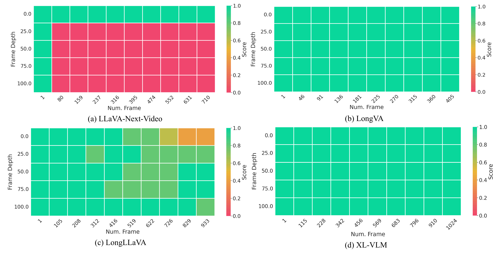

# Video-XL: Extra-Long Vision Language Model for Hour-Scale Video Understanding
<p align="center">
    
</p>
<p align="center"><em>(a) The performance and max frames of different models.<br>(b) Results on Needle-in-a-haystack evaluation on a single 80G GPU.
    </em></p>

<p align="center">
    🌐 <a href="" target="_blank">Blog</a> | 📃 <a href="" target="_blank">Paper</a> | 🤗 <a href="" target="_blank">Hugging Face</a> | 🎥 <a href="" target="_blank">Demo</a>

</p>


✨ **Highlights**:

(i) Comprehensive long video understanding. Video-XL 7B achieves the **leading performance among 7B models** on MLVU, VideoMME, VNBench and LongVideoBench.

(ii) Efficient Long visual context processing. Video-XL can process **2048 frames on an 80G GPU and achieves nearly 95% accuracy** on Needle-in-a-haystack evaluation.

(iii) Video-XL shows strong ability in some real-world scenarios, like **movie summarization, surveillance anomaly detection and Ad placement identification**.


## News
- [2024/10/15] 🔥 Video-XL is released,  including model, training and evaluation code. 
  
## Installation 
```bash
conda create -n videoxl python=3.10 -y && conda activate videoxl
pip install torch==2.1.2 torchvision --index-url https://download.pytorch.org/whl/cu118
pip install -e "videoxl/.[train]"
pip install packaging &&  pip install ninja && pip install flash-attn --no-build-isolation --no-cache-dir
pip install -r requirements.txt
```

### Quick Start With HuggingFace

<details>
    <summary>Example Code</summary>
    
```python
from videoxl.model.builder import load_pretrained_model
from videoxl.mm_utils import tokenizer_image_token, process_images,transform_input_id
from videoxl.constants import IMAGE_TOKEN_INDEX,TOKEN_PERFRAME 
from PIL import Image
from decord import VideoReader, cpu
import torch
import numpy as np
# fix seed
torch.manual_seed(0)


model_path = "assets/videoxl_checkpoint-15000"
video_path="assets/ad2_watch_15min.mp4"

max_frames_num =900 
gen_kwargs = {"do_sample": True, "temperature": 1, "top_p": None, "num_beams": 1, "use_cache": True, "max_new_tokens": 1024}
tokenizer, model, image_processor, _ = load_pretrained_model(model_path, None, "llava_qwen", device_map="cuda:0")

model.config.beacon_ratio=[8]   # you can delete this line to realize random compression of {2,4,8} ratio


#video input
prompt = "<|im_start|>system\nYou are a helpful assistant.<|im_end|>\n<|im_start|>user\n<image>\nDoes this video contain any inserted advertisement? If yes, which is the content of the ad?<|im_end|>\n<|im_start|>assistant\n"
input_ids = tokenizer_image_token(prompt, tokenizer, IMAGE_TOKEN_INDEX, return_tensors="pt").unsqueeze(0).to(model.device)
vr = VideoReader(video_path, ctx=cpu(0))
total_frame_num = len(vr)
uniform_sampled_frames = np.linspace(0, total_frame_num - 1, max_frames_num, dtype=int)
frame_idx = uniform_sampled_frames.tolist()
frames = vr.get_batch(frame_idx).asnumpy()
video_tensor = image_processor.preprocess(frames, return_tensors="pt")["pixel_values"].to(model.device, dtype=torch.float16)

beacon_skip_first = (input_ids == IMAGE_TOKEN_INDEX).nonzero(as_tuple=True)[1].item()
num_tokens=TOKEN_PERFRAME *max_frames_num
beacon_skip_last = beacon_skip_first  + num_tokens

with torch.inference_mode():
    output_ids = model.generate(input_ids, images=[video_tensor],  modalities=["video"],beacon_skip_first=beacon_skip_first,beacon_skip_last=beacon_skip_last, **gen_kwargs)

if IMAGE_TOKEN_INDEX in input_ids:
    transform_input_ids=transform_input_id(input_ids,num_tokens,model.config.vocab_size-1)

output_ids=output_ids[:,transform_input_ids.shape[1]:]
outputs = tokenizer.batch_decode(output_ids, skip_special_tokens=True)[0].strip()
print(outputs)
```
</details>

## Plan

 - [ ] Technical Report
 - [ ] Model
 - [ ] Code
 - [ ] Data


