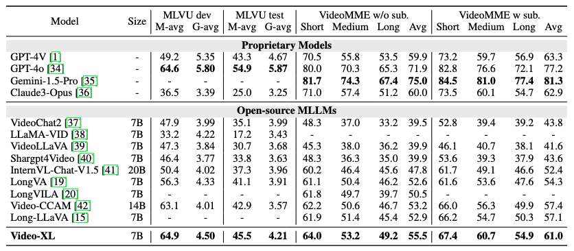
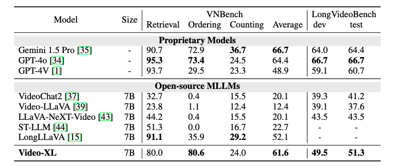

<p align="center">
    
</p>


## Video-XL: Extra-Long Vision Language Model for Hour-Scale Video Understanding
<p align="center">
    🌐 <a href="https://www.xiaohongshu.com/discovery/item/67172f5d0000000024017704?source=webshare&xhsshare=pc_web&xsec_token=GBL17lee3zbjumPCcki1x6IL0okkah9Lp3XX_IzlJwO4I=&xsec_source=pc_share" target="_blank">Blog</a> | 📃 <a href="https://arxiv.org/pdf/2409.14485" target="_blank">Paper</a> | 🤗 <a href="https://huggingface.co/sy1998/Video_XL" target="_blank">Model</a> |  🤗 <a href="https://huggingface.co/datasets/sy1998/Video_XL_Training/tree/main" target="_blank">Data</a> |  🎥 <a href="" target="_blank">Demo</a>

</p>

<p align="center">
    
</p>
<p align="center"><em>(Left) The performance and max frames of different models.<br>(Right) Results on Needle-in-a-haystack evaluation on a single 80G GPU.
    </em></p>


✨ **Highlights**:

(i) Comprehensive long video understanding. Video-XL 7B achieves the **leading performance among 7B models** on MLVU, VideoMME, VNBench and LongVideoBench.

(ii) Efficient Long visual context processing. Video-XL can process **2048 frames on an 80G GPU and achieves nearly 95% accuracy** on Needle-in-a-haystack evaluation.

(iii) Video-XL shows strong ability in some real-world scenarios, like **movie summarization, surveillance anomaly detection and Ad placement identification**.


## News
- [2024/12/22] 🔥 Most of the training data is released, including private baai-caption video data and VICO data. Feel free to use in [link](https://huggingface.co/datasets/sy1998/Video_XL_Training/tree/main). 
- [2024/10/17] 🔥 Video-XL-7B weight is released, which can process max 1024 frames. The model can process 2048 frames is around the corner.
- [2024/10/15] 🔥 Video-XL is released,  including model, training and evaluation code.

## Model weights
Please download our pre-trained and finetuned model weights from the [link](https://huggingface.co/sy1998/Video_XL/tree/main) 
  
## Installation 
```bash
conda create -n videoxl python=3.10 -y && conda activate videoxl
pip install torch==2.1.2 torchvision --index-url https://download.pytorch.org/whl/cu118
pip install -e "videoxl/.[train]"
pip install packaging &&  pip install ninja && pip install flash-attn --no-build-isolation --no-cache-dir
pip install -r requirements.txt
```

## Quick Start With HuggingFace

<details>
    <summary>Example Code</summary>
    
```python
from videoxl.model.builder import load_pretrained_model
from videoxl.mm_utils import tokenizer_image_token, process_images,transform_input_id
from videoxl.constants import IMAGE_TOKEN_INDEX,TOKEN_PERFRAME 
from PIL import Image
from decord import VideoReader, cpu
import torch
import numpy as np
# fix seed
torch.manual_seed(0)


model_path = "assets/videoxl_checkpoint-15000"
video_path="assets/ad2_watch_15min.mp4"

max_frames_num =900 
gen_kwargs = {"do_sample": True, "temperature": 1, "top_p": None, "num_beams": 1, "use_cache": True, "max_new_tokens": 1024}
tokenizer, model, image_processor, _ = load_pretrained_model(model_path, None, "llava_qwen", device_map="cuda:0")

model.config.beacon_ratio=[8]   # you can delete this line to realize random compression of {2,4,8} ratio


#video input
prompt = "<|im_start|>system\nYou are a helpful assistant.<|im_end|>\n<|im_start|>user\n<image>\nDoes this video contain any inserted advertisement? If yes, which is the content of the ad?<|im_end|>\n<|im_start|>assistant\n"
input_ids = tokenizer_image_token(prompt, tokenizer, IMAGE_TOKEN_INDEX, return_tensors="pt").unsqueeze(0).to(model.device)
vr = VideoReader(video_path, ctx=cpu(0))
total_frame_num = len(vr)
uniform_sampled_frames = np.linspace(0, total_frame_num - 1, max_frames_num, dtype=int)
frame_idx = uniform_sampled_frames.tolist()
frames = vr.get_batch(frame_idx).asnumpy()
video_tensor = image_processor.preprocess(frames, return_tensors="pt")["pixel_values"].to(model.device, dtype=torch.float16)

beacon_skip_first = (input_ids == IMAGE_TOKEN_INDEX).nonzero(as_tuple=True)[1].item()
num_tokens=TOKEN_PERFRAME *max_frames_num
beacon_skip_last = beacon_skip_first  + num_tokens

with torch.inference_mode():
    output_ids = model.generate(input_ids, images=[video_tensor],  modalities=["video"],beacon_skip_first=beacon_skip_first,beacon_skip_last=beacon_skip_last, **gen_kwargs)

if IMAGE_TOKEN_INDEX in input_ids:
    transform_input_ids=transform_input_id(input_ids,num_tokens,model.config.vocab_size-1)

output_ids=output_ids[:,transform_input_ids.shape[1]:]
outputs = tokenizer.batch_decode(output_ids, skip_special_tokens=True)[0].strip()
print(outputs)
```
</details>

## Pre-training 
```bash
bash scripts/pretrain.sh
```

## Fine-tuning
You can only utilize single image training data to efficiently train 
```bash
bash scripts/finetune_i.sh
```
or use single image/multi-image/video data to get better performance
```bash
bash scripts/finetune_v.sh
```

## Long Video Benchmark Evaluation
For **MLVU**, **Video-MME**, **LongVideoBench** evaluation, please use  [`lmms-eval`](https://github.com/EvolvingLMMs-Lab/lmms-eval) After installing `lmms-eval` and videoxl, you can use the following script to evaluate.

First, put the [`video_xl.py`](https://github.com/VectorSpaceLab/Video-XL/blob/main/eval/videoxl.py) in lmms-eval/lmms_eval/models. Then add "video_xl" in lmms-eval/lmms_eval/models/__init__.py. Lastly, run the following code.

```bash
accelerate launch --num_processes 8 --main_process_port 12345 -m lmms_eval \
    --model videoxl \
    --model_args pretrained=videoxl_checkpoint_15000,conv_template=qwen_1_5,model_name=llava_qwen,max_frames_num=128,video_decode_backend=decord\
    --tasks videomme \
    --batch_size 1 \
    --log_samples \
    --log_samples_suffix videoxl \
    --output_path ./logs/
```
<details>
<summary>Expand to see the performance on Video-MME and MLVU</summary>

</details>

For **VNBench** evaluation, download [VNBench](https://github.com/joez17/VideoNIAH) and use the following script
```bash
bash eval/eval_vnbench.sh
```
<details>
<summary>Expand to see the performance on VNbench and LongVideoBench</summary>

</details>

## Needle-in-a-haystack evaluation
To be coming soon

## Training Data
Please refer to [train_samples](./assets/train_example.json) so you can finetune with your own image or video data.
We have realsed our trainiing data in [link](https://huggingface.co/datasets/sy1998/Video_XL_Training/tree/main).

## Citation
If you find this repository useful, please consider giving a star :star: and citation

```
@article{shu2024video,
  title={Video-XL: Extra-Long Vision Language Model for Hour-Scale Video Understanding},
  author={Shu, Yan and Zhang, Peitian and Liu, Zheng and Qin, Minghao and Zhou, Junjie and Huang, Tiejun and Zhao, Bo},
  journal={arXiv preprint arXiv:2409.14485},
  year={2024}
}
```

## Acknowledgement
- LongVA: the codebase we built upon. 
- LMMs-Eval: the codebase we used for evaluation.
- Activation Beacon: The compression methods we referring.

## License
This project utilizes certain datasets and checkpoints that are subject to their respective original licenses. Users must comply with all terms and conditions of these original licenses.
The content of this project itself is licensed under the [Apache license 2.0](./LICENSE).


