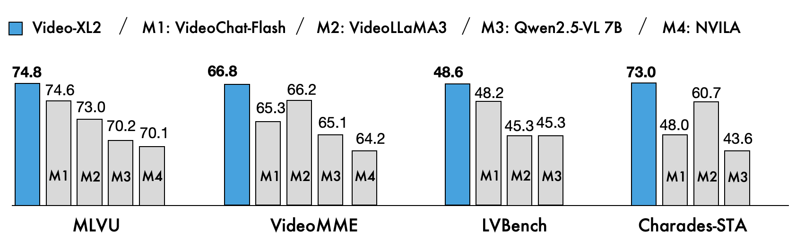

<div align='center'>
<h1>Video-XL-2: A Better, Faster, and High-Frame-Count Model for Long Video Understanding.</h1>
<h3></h3>

| [HomePage](https://unabletousegit.github.io/video-xl2.github.io/) | [Tech Report](https://arxiv.org/abs/2506.19225v1) | [🤗HF Models](https://huggingface.co/BAAI/Video-XL-2) | [🤗Demo](http://39.101.64.147:28787) |

</div>


<div align='center'>

</div>

We introduce **Video-XL-2**, a new suite of multimodal models that achieves state-of-the-art (SOTA) performance and superior efficiency in long video understanding.

### Video-XL-2: SOTA Performance and Unrivaled Efficiency
**Video-XL-2** achieves SOTA performance in mainstream long video understanding benchmarks and leading performance in temporal grounding tasks when compared to open-source lightweight models. Furthermore, it boasts significant advantages over existing models in both memory consumption and inference speed."
<!-- 
<div align='center'>

</div> -->
<!-- 
### Highlights
- **Emu3** is capable of generating high-quality images following the text input, by simply predicting the next vision token. The model naturally supports flexible resolutions and styles.
- **Emu3** shows strong vision-language understanding capabilities to see the physical world and provides coherent text responses. Notably, this capability is achieved without depending on a CLIP and a pretrained LLM.
- **Emu3** simply generates a video causally by predicting the next token in a video sequence, unlike the video diffusion model as in Sora. With a video in context, Emu3 can also naturally extend the video and predict what will happen next.  -->


### TODO
- [X] Release model weights.
- [ ] Release the inference code.
- [X] Release the training code for sft.
- [ ] Release the training guidance.
- [X] Release the evaluation code.
- [ ] Release the evaluation guidance.


### Model Weights

| Model name| HF Weight | Modelscope  | 
| ------------------------ | -------------------------------------------------------------- | ------------------------------------------------------------------------- | 
| **Video-XL-2/Stage3**          | [🤗 HF link](https://huggingface.co/BAAI/Video-XL-2)  | [Modelscope link]()          | 
| **Video-XL-2/Stage4**           | [🤗 HF link](https://huggingface.co/BAAI/Video-XL-2) | [Modelscope link]()           |

### Quickstart

#### Setup

Clone this repository and install required packages:

```shell
git clone https://github.com/VectorSpaceLab/Video-XL
cd Video-XL-2
pip install -r requirements.txt
```

#### Use 🤗Transformers to run Video-XL-2 for video understanding
```python
from transformers import AutoTokenizer, AutoModel, AutoConfig, BitsAndBytesConfig
import torch

# load model 
model_path = '/root/Models/Video-XL-2'
tokenizer = AutoTokenizer.from_pretrained(model_path, trust_remote_code=True)
device = 'cuda' if torch.cuda.is_available() else 'cpu'
model = AutoModel.from_pretrained(model_path, trust_remote_code=True, device_map=device,quantization_config=None,attn_implementation="sdpa").to(torch.bfloat16)

gen_kwargs = {
    "do_sample": True,
    "temperature": 0.01,
    "top_p": 0.001,
    "num_beams": 1,
    "use_cache": True,
    "max_new_tokens": 256
}

enable_sparse = False # use the sparse pattern or not
sparse_mode = 'streaming' # streaming or mask
if enable_sparse:
    model.config.enable_sparse = True
    model.config.sparse_mode = sparse_mode
    block_size_chosed = 4
    prev_blocks_num = 3
    model.config.sparse_config = {'block_size_chosed':block_size_chosed, 'prev_blocks_num':prev_blocks_num}
else:
    model.config.enable_sparse = False

# input data
video_path = "/asset/demo.mp4"
question1 = "How many people in the video? (A)3 people (B)6 people. Please only respone the letter"

# params
max_num_frames = 100
sample_fps = 1  # extract frame at 1fps
max_sample_fps = 4

with torch.inference_mode():
    response = model.chat(video_path, tokenizer, question1, chat_history=None, return_history=False,max_num_frames=max_num_frames, sample_fps=sample_fps, max_sample_fps=max_sample_fps, generation_config=gen_kwargs)
    
print(response)
```

### Training
The training codes and scripts can be found in [./train](./train).

### Evaluation
The evaluation codes and scripts can be found in [./eval](./eval).


## Acknowledgement
We thank the great work from [Video-XL Series](https://github.com/VectorSpaceLab/Video-XL), [LongVA](https://github.com/QwenLM/Qwen2-VL), [lmms-eval](https://github.com/EvolvingLMMs-Lab/lmms-eval), [Qwen](https://github.com/QwenLM/Qwen),[VideoChat-Flash](https://github.com/OpenGVLab/VideoChat-Flash?tab=readme-ov-file).

## Citation

If you find Video-XL-2 useful for your research and applications, please consider starring this repository and citing:

```
@article{shu2024video,
  title={Video-XL: Extra-Long Vision Language Model for Hour-Scale Video Understanding},
  author={Shu, Yan and Zhang, Peitian and Liu, Zheng and Qin, Minghao and Zhou, Junjie and Huang, Tiejun and Zhao, Bo},
  journal={arXiv preprint arXiv:2409.14485},
  year={2024}
}

@article{liu2025video,
  title={Video-XL-Pro: Reconstructive Token Compression for Extremely Long Video Understanding},
  author={Liu, Xiangrui and Shu, Yan and Liu, Zheng and Li, Ao and Tian, Yang and Zhao, Bo},
  journal={arXiv preprint arXiv:2503.18478},
  year={2025}
}

@article{qin2025video,
  title={Video-XL-2: Towards Very Long-Video Understanding Through Task-Aware KV Sparsification},
  author={Qin, Minghao and Liu, Xiangrui and Liang, Zhengyang and Shu, Yan and Yuan, Huaying and Zhou, Juenjie and Xiao, Shitao and Zhao, Bo and Liu, Zheng},
  journal={arXiv preprint arXiv:2506.19225},
  year={2025}
}
```
