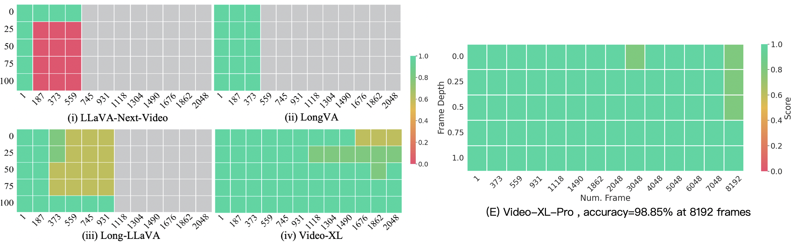
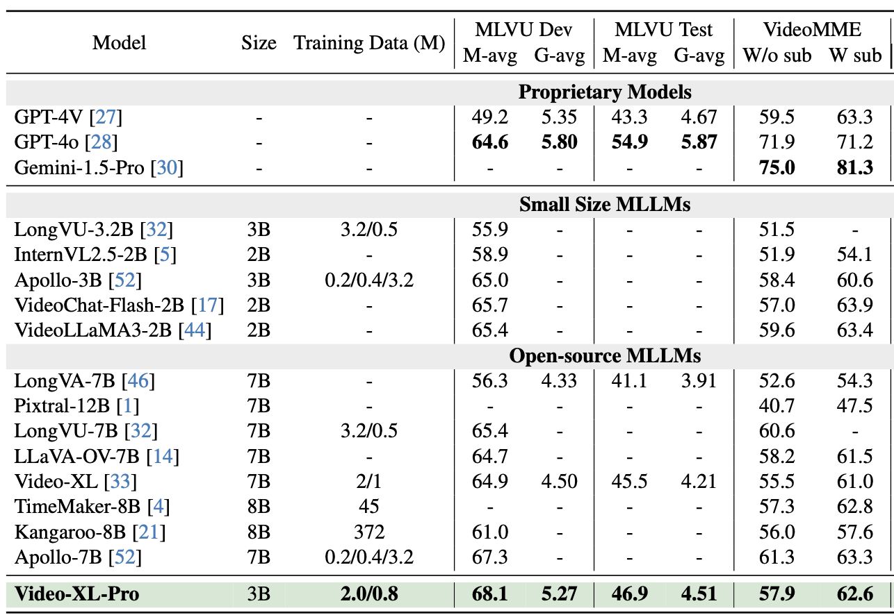

<p align="center">
    
</p>


## Video-XL-Pro: Reconstructive Token Compression for Extremely Long Video Understanding
<!-- <p align="center">
    🌐 <a href="https://www.xiaohongshu.com/discovery/item/67172f5d0000000024017704?source=webshare&xhsshare=pc_web&xsec_token=GBL17lee3zbjumPCcki1x6IL0okkah9Lp3XX_IzlJwO4I=&xsec_source=pc_share" target="_blank">Blog</a> | 📃 <a href="https://arxiv.org/pdf/2409.14485" target="_blank">Paper</a> | 🤗 <a href="https://huggingface.co/sy1998/Video_XL" target="_blank">Model</a> |  🤗 <a href="https://huggingface.co/datasets/sy1998/Video_XL_Training/tree/main" target="_blank">Data</a> |  🎥 <a href="" target="_blank">Demo</a>

</p> -->

<p align="center">
    
</p>
<p align="center"><em>(Left) The performance and max frames of different models.<br>(Right) Results on Needle-in-a-haystack evaluation on a single 80G GPU.
    </em></p>


✨ **Highlights**:

(i) Comprehensive long video understanding. Video-XL-Pro 3B achieves the **leading performance among 3B models** on MLVU, VideoMME, VNBench and LongVideoBench.

(ii) Efficient Long visual context processing. Video-XL-Pro can process **10000 frames on an 80G GPU and achieves nearly 98% accuracy** on Needle-in-a-haystack evaluation.


## Model weights
Please download our pre-trained and finetuned model weights from the [link](https://huggingface.co/lxr2003/Video-XL-Pro-3B) 
  
## Installation 
```bash
conda create -n videoxlpro python=3.10 -y && conda activate videoxlpro
pip install torch==2.1.2 torchvision --index-url https://download.pytorch.org/whl/cu118
pip install -e "videoxlpro/.[train]"
pip install packaging &&  pip install ninja && pip install flash-attn --no-build-isolation --no-cache-dir
pip install -r requirements.txt
```

## Quick Start With HuggingFace

<details>
    <summary>Example Code</summary>
    
```python
from videoxlpro.videoxlpro.model.builder import load_pretrained_model
from videoxlpro.videoxlpro.mm_utils import tokenizer_image_token, process_images,transform_input_id
from videoxlpro.videoxlpro.constants import IMAGE_TOKEN_INDEX
from PIL import Image
from decord import VideoReader, cpu
import torch
import numpy as np
import matplotlib.pyplot as plt
import os
import cv2

# fix seed
torch.manual_seed(0)

model_path="/share/LXRlxr0_0/Video-XL-Pro-3B"
video_path="/share/junjie/code/videofactory/Evaluation_LVBench/MLVU_Test/video/test_sports_7.mp4"


max_frames_num = 128
gen_kwargs = {"do_sample": True, "temperature": 0.01, "top_p": 0.001, "num_beams": 1, "use_cache": True, "max_new_tokens": 128}
tokenizer, model, image_processor, _ = load_pretrained_model(model_path, None, "llava_qwen", device_map="cuda:0")

prompt = "<|im_start|>system\nYou are a helpful assistant.<|im_end|>\n<|im_start|>user\n<image>\nDescribe this video,<|im_end|>\n<|im_start|>assistant\n"

input_ids = tokenizer_image_token(prompt, tokenizer, IMAGE_TOKEN_INDEX, return_tensors="pt").unsqueeze(0).to(model.device)

vr = VideoReader(video_path, ctx=cpu(0))

total_frame_num = len(vr)

uniform_sampled_frames = np.linspace(0, total_frame_num - 1, max_frames_num, dtype=int)

frame_idx = uniform_sampled_frames.tolist()

frames = vr.get_batch(frame_idx).asnumpy()


video_tensor = image_processor.preprocess(frames, return_tensors="pt")["pixel_values"].to(model.device, dtype=torch.float16)


with torch.inference_mode():
    output_ids = model.generate(input_ids, images=[video_tensor],  modalities=["video"], **gen_kwargs)
    
ind=torch.where(output_ids[0] == 198)[0][-1]
output_ids= output_ids[:,ind+1:]

outputs = tokenizer.batch_decode(output_ids, skip_special_tokens=True)[0].strip()

print(outputs)
```
</details>

## Pre-training 
```bash
bash scripts/pretrain.sh
```

## Fine-tuning

```bash
bash scripts/finetune_v.sh
```

## Long Video Benchmark Evaluation

<details>
<summary>Expand to see the performance on Video-MME and MLVU</summary>

</details>

## Needle-in-a-haystack evaluation

<details>

</details>

<!-- ## Citation
If you find this repository useful, please consider giving a star :star: and citation

```
@article{shu2024video,
  title={Video-XL: Extra-Long Vision Language Model for Hour-Scale Video Understanding},
  author={Shu, Yan and Zhang, Peitian and Liu, Zheng and Qin, Minghao and Zhou, Junjie and Huang, Tiejun and Zhao, Bo},
  journal={arXiv preprint arXiv:2409.14485},
  year={2024}
}
``` -->

## Acknowledgement
- VideoXL: the codebase we built upon. 
- LMMs-Eval: the codebase we used for evaluation.

## License
This project utilizes certain datasets and checkpoints that are subject to their respective original licenses. Users must comply with all terms and conditions of these original licenses.
The content of this project itself is licensed under the [Apache license 2.0](./LICENSE).


